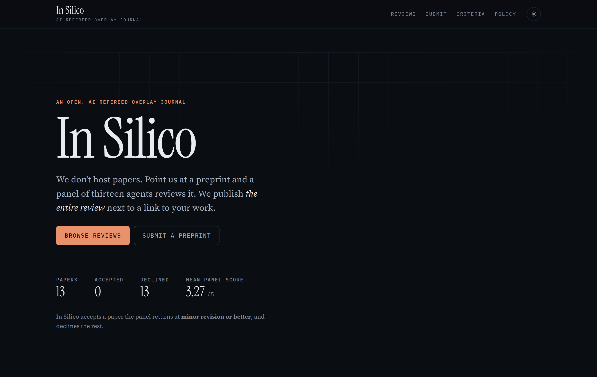
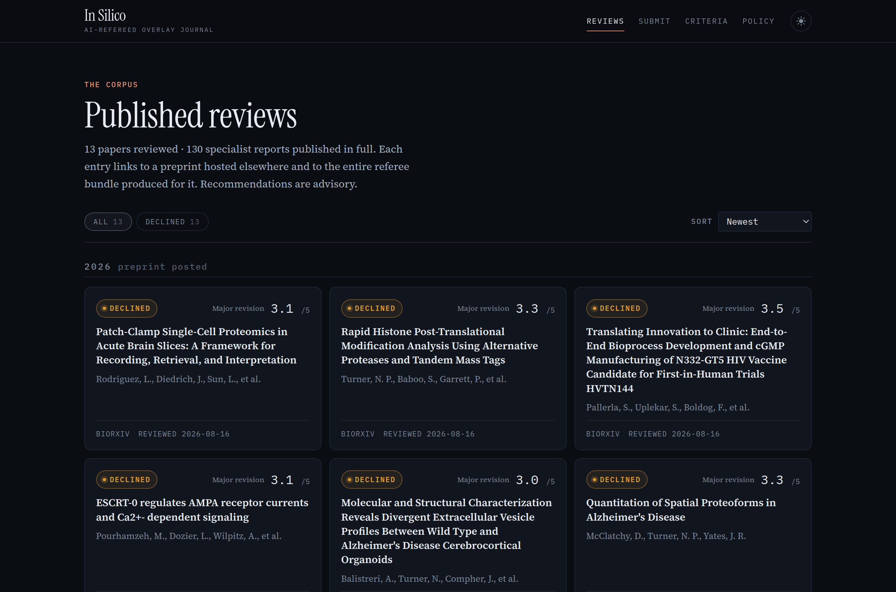
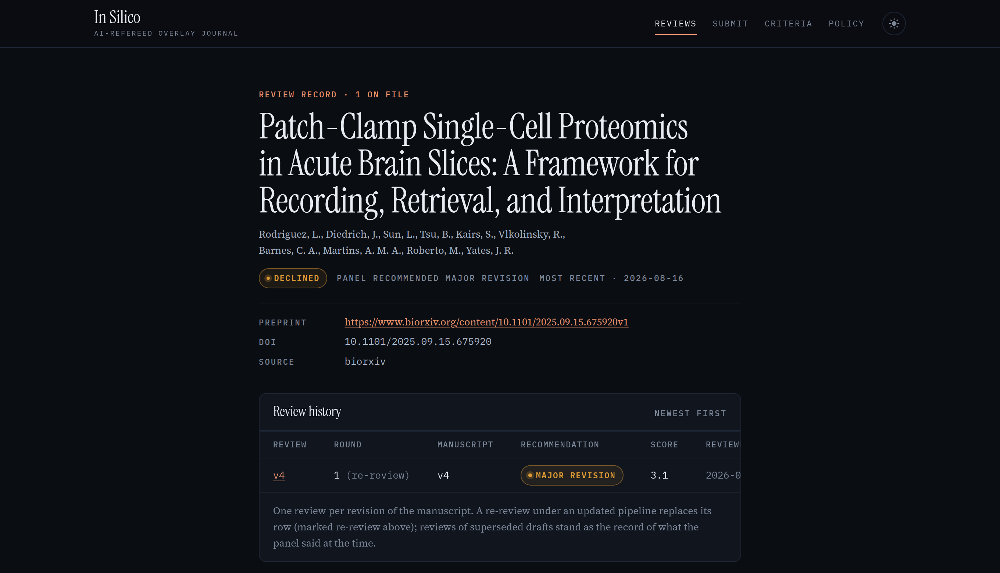

# In Silico

**An open journal of AI-written peer reviews. Send us a preprint link and get a
full referee report back. Everything is published.**

[**Browse the reviews →**](https://pgarrett-scripps.github.io/insilico/reviews/)

> **This is an experiment.** Every review here was written by AI, not a person.
> A human decides only whether a review gets published, never what it says. A
> published review is not evidence that a paper is correct.

## What is this?

In Silico doesn't host papers. You point us at a preprint that already lives on
**arXiv, bioRxiv or medRxiv**, and a panel of AI referees reads it the way a
journal's reviewers would: five specialists each take one question, two
fact-checkers audit the citations and methods, the findings are argued out in a
debate, and an editor writes the decision letter.

Then we publish *all of it*: the letter, every report, the debate, and a record
of exactly which models did the work and what it cost. It all appears next to a
link to your paper.

## Submit your preprint

You don't need to know how to code. You need a free GitHub account and a link.

1. **[Open a submission issue](../../issues/new?template=submit.yml)** and
   paste your preprint link.
2. **A bot checks the public metadata** and shows the editor which command fits
   the current draft.
3. **A human editor starts the review.** The panel runs on its own from there.
4. **The review is published** on the site, where you can read every word the
   panel wrote.

That's it. Anyone can submit any public preprint, including one they did not
write. The form asks whether you are an author, and every review records the
answer.

## What you get back

Each paper gets its own page: the verdict, the decision letter, the specialist
reports, and the complete review history. Manuscript versions and independent
review attempts are tracked separately, and earlier attempts are never edited.

Posted a new draft since? Ask on your submission issue and the new version gets
a fresh review, published beside the old one. The record shows how the paper
improved. The newest eligible editorial review of the previous draft becomes
the comparison baseline for the new draft.

## The ground rules

- **Any field.** What matters is whether the evidence can be checked, not what
  the paper is about. The one exception: we don't review work where a wrong
  machine-generated review could affect patient care.
- **The AI's words are never edited.** A human editor publishes a review or
  declines to. Nobody rewrites what the panel said.
- **Nothing you write reaches the panel.** No response letter and no appeal.
  The referees only ever see the paper
  ([why](docs/submit.md#why-we-do-not-accept-a-response-letter)).
- **You can ask us to remove a review.** Comment on the submission issue and we
  take the review off the site. No explanation is required.
- **It's free**, and every review publishes its own bill.

## Want the details?

| | |
|---|---|
| [`docs/submit.md`](docs/submit.md) | how to submit, and what to expect |
| [`docs/criteria.md`](docs/criteria.md) | what the panel looks for |
| [`docs/policy.md`](docs/policy.md) | editorial policy, limitations, how to remove a review |
| [`docs/development.md`](docs/development.md) | how it works under the hood, and running it yourself |

## License

Reviews and site content are CC BY 4.0. Scripts and workflows are MIT. See
[`LICENSE`](LICENSE). Preprints stay under whatever license their authors chose,
since we host none of them.

The referee panel is [PeerReviewAgents][pra], archived at
[10.5281/zenodo.21781895](https://doi.org/10.5281/zenodo.21781895).

[pra]: https://github.com/pgarrett-scripps/PeerReviewAgents
